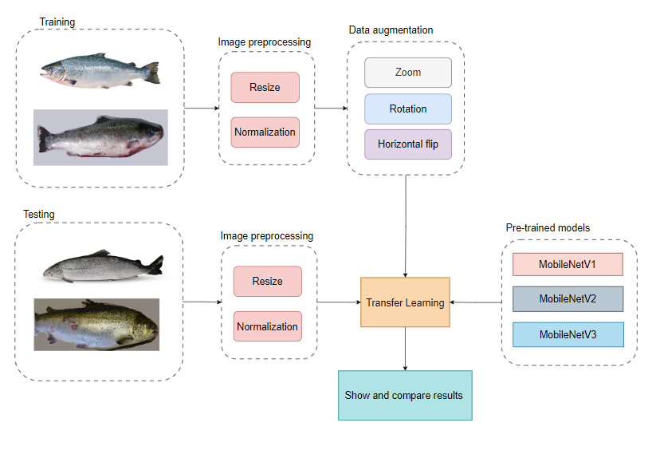
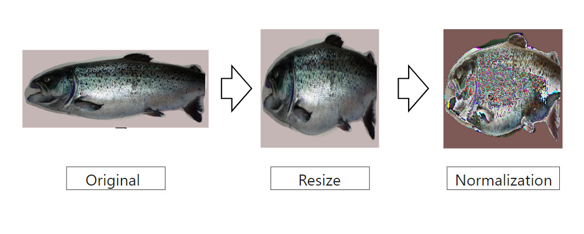
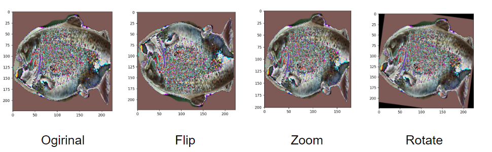
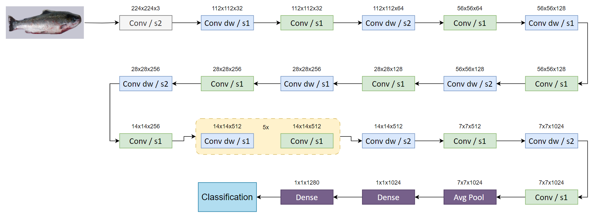

#Fish Disease Detection based on MobileNet versions

The workflow to detect fish disease

The input image need to resize and normalize before performing training and evaluation

The training set be augmented to increase number of image in set

The illustration of  layers in the MobileNet

